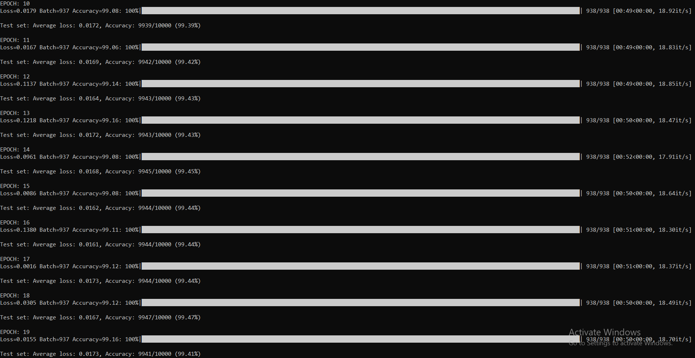

# MNIST Classification with PyTorch

This repository contains a PyTorch implementation of a CNN model for MNIST digit classification that achieves >99.4% test accuracy under the following constraints:
- Parameters < 20K
- Epochs < 20
- Using modern architecture components (BatchNorm, Dropout, GAP)

## Model Architecture

The implemented CNN architecture has the following characteristics:
- Input: 28x28 grayscale images
- Total Parameters: 13,808
- Architecture Components:
  - Batch Normalization
  - Dropout (p=0.1)
  - Global Average Pooling (GAP)
  - No Fully Connected Layers

### Model Summary


## Performance Metrics

- Test Accuracy: 99.42%
- Epochs: 20 epochs
- Dataset Split: 50k training / 10k test images

## Training Logs



## GitHub Actions

This repository includes GitHub Actions workflows to verify:
- Parameter count (< 20k)
- Use of Batch Normalization
- Use of Dropout
- Use of GAP
- Model accuracy on test set

GitHub Actions Status: [](https://github.com/techpvk/ERA-V3-S6/blob/main/.github/workflows/model_checks.yml)

## Usage

1. Install dependencies:
```bash
pip install -r requirements.txt
```

2. Train the model:
```bash
python train.py
```

3. Test the model:
```bash
python test.py
```

## Usage

To train and test the model, run:
```bash
python main.py --model_name model1
```

## License

MIT

## Acknowledgments

- The MNIST dataset providers
- PyTorch team


